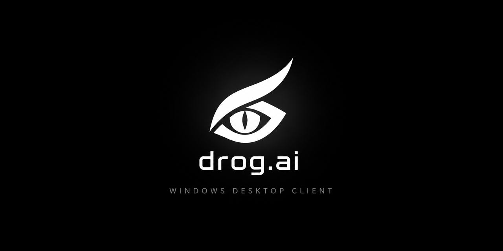

<p align="center">
  
</p>

<p align="center">
  <a href="https://github.com/deepdrogo/drogai_windows_chatbot_releases/releases/latest"></a>
  <a href="https://github.com/deepdrogo/drogai_windows_chatbot_releases/releases"></a>
  
  
</p>

<h1 align="center">drog.ai for Windows</h1>

<p align="center">
  Official native desktop client for <a href="https://drog.ai">drog.ai</a>.<br>
  Not a browser tab. Not Electron. A real Windows app, with in-app updates from this repo.
</p>

<p align="center">
  <a href="https://github.com/deepdrogo/drogai_windows_chatbot_releases/releases/latest/download/drogai-setup.exe"><strong>Download for Windows</strong></a>
  &nbsp;·&nbsp;
  <a href="https://github.com/deepdrogo/drogai_windows_chatbot_releases/releases/latest">Release notes</a>
  &nbsp;·&nbsp;
  <a href="https://drog.ai">Website</a>
</p>

---

## What this repository is

**Installer binaries only.** Source is not stored here. Every published version is a GitHub Release: the setup executable, a stable `drogai-setup.exe` alias that always tracks latest, and a `latest.json` feed the running app polls.

| File | Purpose |
| --- | --- |
| `drogai-setup.exe` | Always the newest installer. Use this link on the website. |
| `drogai-setup-<version>.exe` | That same build, pinned to a version. What the in-app updater downloads. |
| `latest.json` | Version, notes, download URL, size, and SHA-256. |

Latest release: **[github.com/deepdrogo/drogai_windows_chatbot_releases/releases/latest](https://github.com/deepdrogo/drogai_windows_chatbot_releases/releases/latest)**

---

## Install

1. Download [`drogai-setup.exe`](https://github.com/deepdrogo/drogai_windows_chatbot_releases/releases/latest/download/drogai-setup.exe).
2. Run it. Setup installs per-user under `%LOCALAPPDATA%\Programs\drog.ai` — no administrator prompt.
3. Open drog.ai and sign in with your browser. The token is stored in Windows Credential Manager.

Windows may show a SmartScreen warning on the first download until the installer earns reputation. Choose **More info → Run anyway** if you downloaded it from this repository.

**Requirements:** Windows 10 or 11, 64-bit.

---

## Updates

Installed copies check this repository on launch (after a short delay) and every six hours.

- A newer version raises a banner in the app and a card under **Settings → Updates**.
- **Update now** downloads the installer, verifies its SHA-256 against `latest.json`, then runs it silently. drog.ai closes, is replaced, and reopens on its own.
- **Check for updates** reports that you are current when no newer build exists.

Stable URLs the app and the website can keep forever:

```
https://github.com/deepdrogo/drogai_windows_chatbot_releases/releases/latest/download/drogai-setup.exe
https://github.com/deepdrogo/drogai_windows_chatbot_releases/releases/latest/download/latest.json
```

---

## Verify a download

```powershell
Get-FileHash .\drogai-setup.exe -Algorithm SHA256
```

The hash must match `sha256` in [`latest.json`](https://github.com/deepdrogo/drogai_windows_chatbot_releases/releases/latest/download/latest.json). A mismatch means the file is not the published build — delete it.

---

## Embed on a website

Always-latest button:

```html
<a href="https://github.com/deepdrogo/drogai_windows_chatbot_releases/releases/latest/download/drogai-setup.exe">
  Download drog.ai for Windows
</a>
```

Do not iframe github.com — GitHub blocks that. Host your own snippet if you need a widget; the download URL above does not change between versions.

---

## Support

Product, accounts, and billing: **[drog.ai](https://drog.ai)**

Installer issues can be opened on this repo. Application source is not published here.

© drog.ai · All rights reserved
